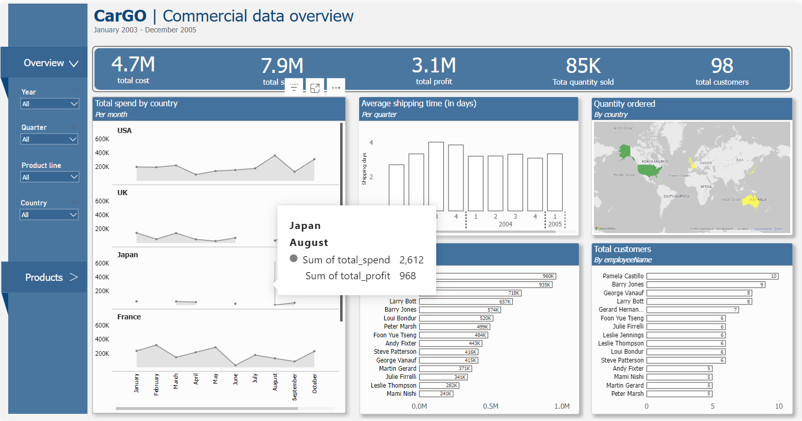
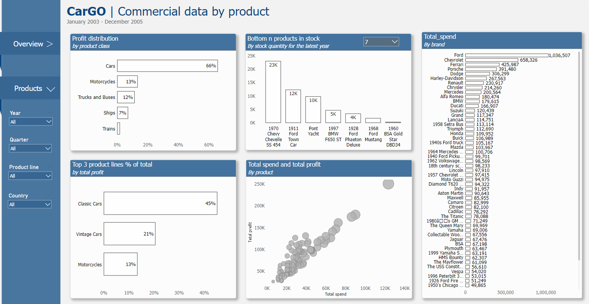

## Final project Brillio Academy

This repository contains the entire technical project
 after the end of the academy, 
 where I studied SQL, Tableau,  Power BI, Alteryx 
 from 2nd September until 27 September 2025.

### This project contains 3 parts:
*1. A SQL script in which I did CRUD operations**
   
*2. An Alteryx file where I performed the following ETL operations:*

    •	Use the tool that automatically attributes the best data type to each field.
    •	Remove trailing spaces from the fields where there are issues. 
    •	Unselect the fields that appear twice as well as “buyPrice” and “priceEach”.
    •	Create a new column “employeeName”, structured as firstName lastName.
    •	Create a new column “ contactName”, structured as contactFirstName contactLastName.
    •	Remove the word “street” from addressLine1.
    •	Keep only the last 3 digits from the orderNumber.
    •	Exclude rows for productCode S18_3136.
    •	Create a new column “manufacturingYear” that shows the year for the products included in product lines containing the word ‘Cars’. (Hint: look at the beginning of each product name for the year)
    •	Transform shipping date to a string that will look like March 10, 2003. Name the new column “strShippedDate”.
    •	Calculate the shipping time in days (shipped date – order date). Name the column “shippingTime”.
    •	Split productCode in two fields, using “_” as separator. 
    •	Create a new column “profitperUnit” where profit = roundedpriceEach – roundedbuyPrice.
    •	Calculate the total “spend” as roundedpriceEach multiplied by quantityOrdered.
    •	Calculate the total “cost” as roundedbuyPrice multiplied by quantityOrdered.
    •	Calculate the total “profit” as spend – cost.
    •	Rename productCode1 as productCodeShort and productCode2 as productCodeNumber.
    •   Export the file in CSV/xlsx format
    
*3. A Power BI dashboard based of the data from Alteryx at step 2, 
which should have contained at least the following elements:* 

    •	Show the employees and the number of customers they each have, in descending order.
    •	Map the countries in order to highlight the one with the highest ordered quantity of products.
    •	Show the trended evolution of monthly spend by country.
    •	Show top 3 product lines by profit as part of a whole.
    •	Show the relationship between spend and profit, to see if there are any outliers.
    •	Show bottom X (where X between 3 and 10, and it can be dynamically selected by the user) products according to stock, for the latest year.
    •	Avg quarterly shipping time, split per year.

